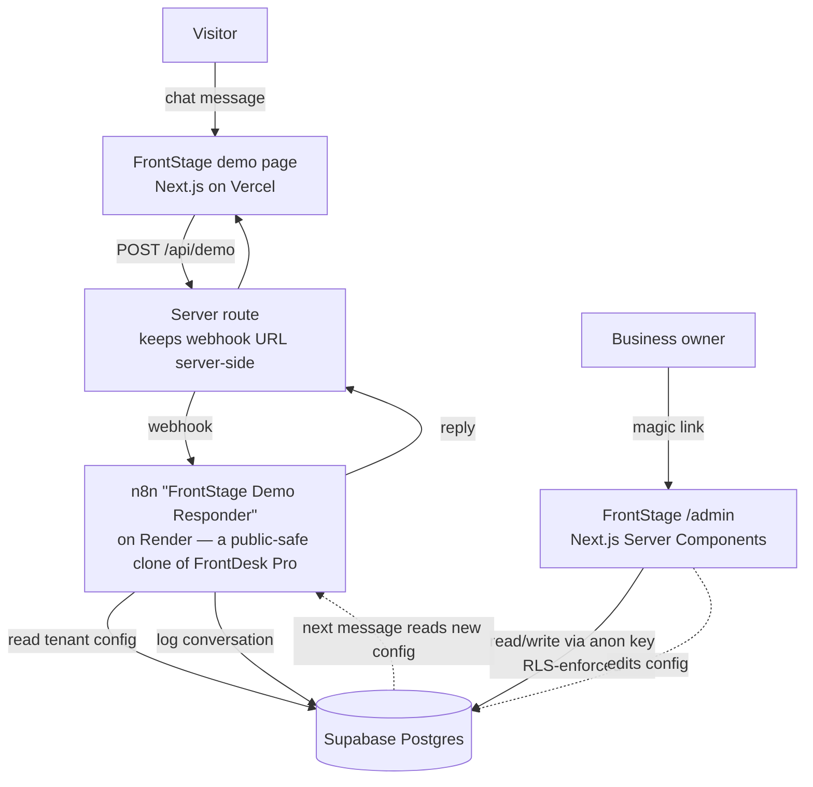

# FrontStage

**A multi-tenant SaaS front-end for an AI front desk** — public demo chat + a self-serve owner dashboard — built on **Next.js (Vercel)**, **Supabase**, and an **n8n** automation backend.

> FrontStage is the product face bolted onto an existing n8n build (**FrontDesk Pro**, an AI receptionist for service businesses). The conversational AI lives in n8n; FrontStage adds the public demo, passwordless auth, database-enforced tenant isolation, a live config editor, and a conversation dashboard.

🔗 **Live demo (chat with the AI front desk):** https://frontstage-three.vercel.app/demo/vKBMdWARfZ9coyZkgLV7
🔒 **Owner dashboard:** https://frontstage-three.vercel.app/admin *(magic-link login — each owner sees only their own tenant)*

---

## What it does

- **Public demo chat** — a visitor talks to the AI front desk for a business ("Bright Smile Dental"). The agent answers from that tenant's live config (services, hours, tone, FAQ) and holds short-term memory. Booking is a safe **dry-run** — no real calendar writes on a public URL.
- **Owner sign-in** — passwordless **magic link** (Supabase Auth). No passwords stored or handled.
- **Tenant isolation** — enforced at the database with **Postgres Row-Level Security**. An owner can read/edit *only* the rows they own; proven with SQL-level tests, not just UI.
- **Self-serve config editor** — the owner edits services/hours/tone/FAQ in the dashboard; the change is written back through RLS and **immediately changes what the live agent says** (the n8n workflow reads config on every message).
- **Live conversation log + metrics** — every demo chat is logged; the dashboard shows conversation history, total conversations, and unique leads.

---

## Architecture



**Two backends, one datastore:**
1. **n8n** (over an HTTP webhook) — the live conversational AI. This is the reused *FrontDesk Pro* build, cloned and stripped of real GHL booking so it's safe on a public page.
2. **Supabase** (directly) — the shared Postgres database (`clients` config + `interactions` log), plus Supabase Auth for the owner login.

---

## Tech stack

| Layer | Tech |
|---|---|
| Front-end / hosting | Next.js 16 (App Router, Server Components, Server Actions) · TypeScript · Tailwind · **Vercel** |
| Auth | Supabase Auth — email **magic link** (`@supabase/ssr`) |
| Database | Supabase **Postgres** with **Row-Level Security** |
| AI backend | **n8n** (on Render) — webhook-invoked workflow · OpenAI `gpt-4o-mini` |
| Email delivery | Resend (custom SMTP for reliable magic links) |

---

## Security model

- **Secrets never reach the browser.** The Supabase `service_role` key and the n8n webhook URL live only in server environment variables / server routes. The demo page talks to n8n through a server route (`/api/demo`) so the webhook URL is never exposed.
- **RLS is the tenant boundary.** The dashboard reads and writes with the **anon key under the logged-in user's session**, so Postgres RLS decides what each owner can touch:
  - `clients` — `select`/`update` policies gated on `owner_id = auth.uid()`.
  - `interactions` — `select` policy joined through `clients` (`location_id in (select location_id from clients where owner_id = auth.uid())`).
  - Isolation is verified by impersonating a different `auth.uid()` in SQL: an unrelated user sees **0 rows**; the owner sees their own.
- **Server Actions re-check auth.** Config writes run in a Server Action that re-verifies the session server-side (Server Functions are reachable via direct POST, not just the UI) and **whitelists editable columns** — `ghl_token`, `owner_id`, and `location_id` can never be written from the UI.

---

## Project structure

```
src/
  app/
    demo/[locationId]/page.tsx   Public demo page (loads tenant, renders chat)
    api/demo/route.ts            Server proxy → n8n webhook (keeps URL server-side, 30s timeout)
    admin/page.tsx               Owner dashboard: config editor + activity panel (RLS reads)
    admin/login/page.tsx         Magic-link sign-in form
    admin/actions.ts             updateConfig Server Action (auth check + whitelisted RLS write)
    auth/callback/route.ts       Exchanges the magic-link code for a session
    auth/signout/route.ts        Signs out
  components/
    DemoChat.tsx                 Client chat UI (per-session id → agent memory, error handling)
    ConfigForm.tsx               Client form (useActionState) → updateConfig
    ActivityPanel.tsx            Conversation log + metrics tiles
  utils/supabase/
    client.ts / server.ts        Browser + server Supabase clients (RLS, anon key)
    middleware.ts                Session-refresh helper
  lib/supabase.ts                service_role client (server-only reads)
  proxy.ts                       Next 16 proxy (was middleware.ts) — refreshes the auth session
```

---

## How a config edit reaches the live agent

1. Owner edits **Services** in `/admin` and hits Save.
2. `ConfigForm` calls the `updateConfig` Server Action → re-checks auth → `UPDATE clients ...` (RLS ensures it's the owner's row) → whitelisted columns only.
3. A visitor asks the demo agent about the new service.
4. The n8n workflow reads the `clients` row from Supabase **on that message** → the agent answers with the updated config.

No redeploy, no code change — editing config in the dashboard changes what the live AI says.

---

## Local development

```bash
npm install
npm run dev   # http://localhost:3000
```

Environment (`.env.local`):

```
NEXT_PUBLIC_SUPABASE_URL=...
NEXT_PUBLIC_SUPABASE_ANON_KEY=...      # browser-safe; RLS protects the data
SUPABASE_SERVICE_ROLE_KEY=...          # server-only, never NEXT_PUBLIC
N8N_DEMO_WEBHOOK_URL=...               # server-only
```

---

## Build milestones

| Milestone | What shipped |
|---|---|
| M0 | Next.js scaffold, deployed to Vercel with auto-deploy on push |
| M1 | Read tenant config from Supabase (server-side, service_role) |
| M2 | Public demo chat page wired to the n8n responder |
| M3 | Magic-link auth + RLS tenant isolation (proven in SQL) |
| M4 | Self-serve config editor (RLS-enforced writes via Server Action) |
| M5 | Live conversation log + metrics (n8n logs every demo chat) |
| M6 | Packaging: docs, architecture, portfolio |

---

*Front-end and dashboard: Next.js on Vercel. Conversational AI: an n8n automation invoked over a webhook. Shared datastore: Supabase Postgres with row-level tenant isolation.*
